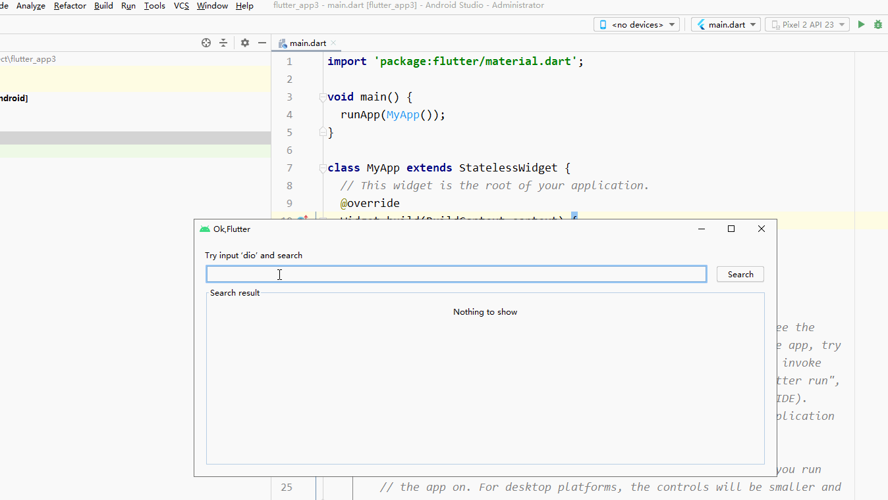

# Ok,Flutter

Ok,Flutter , quickly find and add Flutter dependencies(data source from '[https://pub.dev/](https://pub.dev/ "https://pub.dev/")' ), Idea comes from okGradle plugin

# How to use
    
    0.click tool menu,select 'OK,Flutter' plugin.
    
	1.input keyworld and click search button
	
	2. wait search result.
	
	3.click 'copy dependencies' button, 

	4.goto  'pubspec.yaml' Paste 

	5.final execution 'pub get'

# Note

	1.if search fail (eg:timeout,connect fail...),plese manually open website search.

	2.if you want find more version,please click last 'website' button.